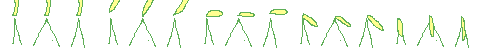

leagueOfScumbags
================

Libre html5 game using phaser.io.

In terms of gameplay it will be a bit like a cross between a JRPG, Liero when
you set the reload time down really low, and Super Smash Bros.

Dependencies and that
---------------------
 - typescript
 - python
 - uglify-js

python is just used to parse scripts into the right format, and uglify-js just
makes it more compact.
It's written in typescript, so you're definitely going to need that one.
